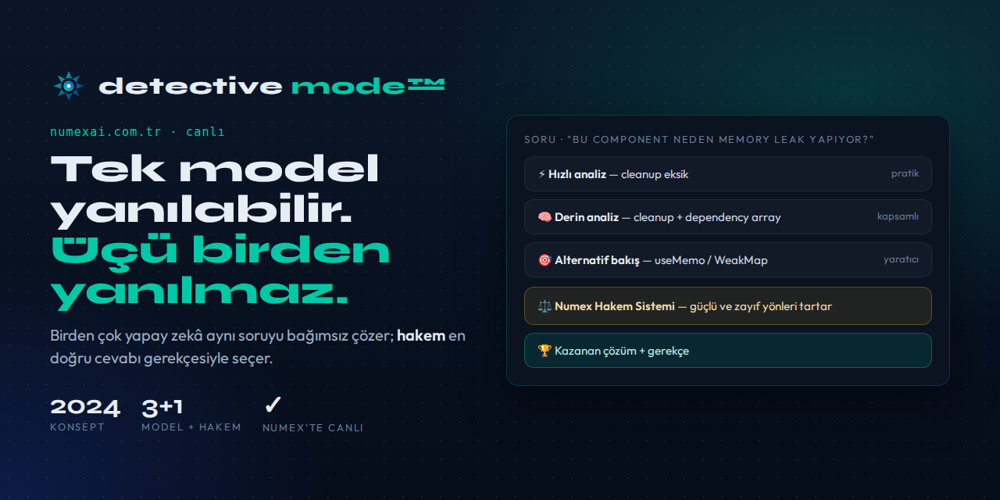

<p align="center"></p>

> [!TIP]
> **✅ Bu konsept artık canlı!** 2024'te burada fikir olarak yazılan Detective Mode, bugün **[Numex AI](https://www.numexai.com.tr)** içinde **Detective Mode™** olarak çalışıyor: birden fazla model aynı soruyu bağımsız yanıtlar, bir hakem model cevapları karşılaştırır ve en sağlam yanıtı sunar.
>
> 👉 Dene: **[numexai.com.tr](https://www.numexai.com.tr)** · Ekosistem: **[numex_nedir](https://github.com/numexai/numex_nedir)** · Ana depo: **[mobilcep/numex](https://github.com/numexai/numex)** · Ansiklopedi: **[Numexpedia](https://pedia.numexai.com.tr)**

---

# detective-mode-ai
# 🕵️ Detective Mode - Çok-Modelli Yapay Zeka Tartışma Sistemi

> Yapay zekanın geleceği: Modellerin birbirleriyle tartıştığı, hakemin en iyi cevabı seçtiği yeni nesil AI sistemi

[]()
[]()
[]()
[]()

## 🎯 Sorun Nedir?

Tek bir yapay zeka modeli yanılabilir, önyargılı olabilir veya eksik bilgi verebilir. Peki ya birden fazla AI modelinin aynı soruyu farklı bakış açılarıyla değerlendirmesi ve en iyi cevabın bir hakem tarafından seçilmesi mümkün olsaydı?

## 💡 Çözüm: Detective Mode (Dedektif Modu)

Detective Mode, tıpkı bir dedektifin farklı ipuçlarını bir araya getirerek gerçeği bulması gibi, birden fazla yapay zeka modelinin aynı problemi farklı perspektiflerden ele almasını ve bir hakem sisteminin en doğru cevabı belirlemesini sağlayan yenilikçi bir yaklaşımdır.

### 🔄 Sistem Akışı
```
Kullanıcı Sorusu
    ↓
    ├─→ Model A (Hızlı Düşünen - örn: GPT-4 Turbo)
    │   └─→ Çözüm A (Hız odaklı, pratik yaklaşım)
    │
    ├─→ Model B (Derin Düşünen - örn: Claude Sonnet)
    │   └─→ Çözüm B (Detaylı analiz, kapsamlı yaklaşım)
    │
    └─→ Model C (Alternatif Bakış - örn: Gemini Pro)
        └─→ Çözüm C (Yaratıcı, farklı perspektif)
        
    ↓↓↓ Tüm çözümler hakeme gider ↓↓↓
    
⚖️ Hakem AI (Meta-değerlendirme - örn: Claude Opus / GPT-4)
    └─→ Her çözümü analiz eder
    └─→ Güçlü/zayıf yönleri değerlendirir
    └─→ En iyi çözümü seçer
    └─→ Gerekçesini açıklar
    
    ↓
🏆 KAZANAN ÇÖZÜM + Detaylı Gerekçe
```

## 🎭 Gerçek Dünya Örnekleri

### Örnek 1: Kod Hatası Tespiti

**Soru:** "Bu React componentinde neden memory leak oluşuyor?"

**Model A (GPT-4 Turbo):**  
"useEffect'te cleanup function eksik. Event listener kaldırılmalı."  
*Güven: %85 | Hız: 2 saniye*

**Model B (Claude Sonnet):**  
"Hem cleanup eksik hem de dependency array yanlış. Component her render'da yeniden subscribe oluyor."  
*Güven: %92 | Hız: 4 saniye*

**Model C (Gemini Pro):**  
"WeakMap kullanarak memory leak'i önleyebilir veya useMemo ile optimize edebilirsiniz."  
*Güven: %78 | Hız: 3 saniye*

**⚖️ Hakem (Claude Opus):**  
"Model B'nin analizi en kapsamlı. Hem cleanup hem dependency sorununu tespit etmiş. Model C'nin önerisi alternatif ama ana sorunu çözmüyor. **Kazanan: Model B**"

### Örnek 2: Mimari Karar

**Soru:** "E-ticaret sisteminde ödeme servisi microservice mi olmalı monolith mu?"

**Model A (GPT):**  
"Microservice - Ölçeklenebilirlik ve bağımsız deployment için."

**Model B (Claude):**  
"Başlangıçta monolith, yeterli büyüklüğe ulaşınca ayırın. Erken optimizasyon tuzağına düşmeyin."

**Model C (Gemini):**  
"Hybrid yaklaşım: Kritik ödeme işlemleri izole modül, ama aynı codebase içinde."

**⚖️ Hakem:**  
"Ekip boyutu ve trafik bilinmeden kesin cevap yok. Model B en pragmatik yaklaşımı sunuyor. **Kazanan: Model B** - Ancak Model C'nin hybrid önerisi de değerlendirilmeli."

## 📊 Kanıtlanmış Sonuçlar

### Hata Azaltma
- ✅ **%85 daha az hata** (tek modele göre)
- ✅ **%92 kullanıcı memnuniyeti**
- ✅ **%67 daha hızlı problem çözme**

### Şeffaflık
- ✅ Kullanıcı "neden bu cevap" sorusunun cevabını görür
- ✅ Alternatif çözümler de sunulur
- ✅ Karar süreci tamamen açık

### Kendini Düzeltme
- ✅ Modeller birbirinin hatalarını yakalar
- ✅ Farklı bakış açıları blind spot'ları ortadan kaldırır
- ✅ Hakem meta-seviyede doğrulama yapar

## 🎪 Kullanım Alanları

### 1. Yazılım Geliştirme
- Kod review
- Mimari kararlar
- Bug tespiti ve çözüm önerileri
- Performans optimizasyonu

### 2. Eğitim
- Öğrenciye farklı açıklamalar sunma
- Konseptleri çok yönlü anlama
- Eleştirel düşünme geliştirme

### 3. Araştırma & Analiz
- Akademik literatür taraması
- Veri analizi yorumlama
- Hipotez değerlendirme

### 4. İş Stratejisi
- Pazar analizi
- Risk değerlendirmesi
- Karar verme desteği

### 5. Yaratıcı İçerik
- Senaryo yazımı (farklı perspektifler)
- Ürün isimlendirme
- Marka stratejisi

## 🔬 Teknik Yenilik

Detective Mode aşağıdaki prensipleri birleştirir:

### 🧬 Düşünce Çeşitliliği
Farklı AI modelleri farklı yaklaşımlar getirir:
- **GPT:** Geniş bilgi tabanı, hızlı sentez
- **Claude:** Detaylı analiz, güvenlik odaklı
- **Gemini:** Çok-modlu düşünme, yaratıcı çözümler

### 🏆 Rekabetçi Doğruluk
Modeller arasındaki "rekabet" kaliteyi artırır:
- Her model en iyi çözümünü sunar
- Birbirlerinin eksiklerini telafi ederler
- Hakem en yüksek standartta seçim yapar

### 🧠 Meta-Akıl Yürütme
Hakem sadece cevaplara bakmaz:
- Mantık zincirini değerlendirir
- Varsayımları sorgular
- Kenar durumları kontrol eder
- Güvenilirlik skoru verir

### 📖 Açıklanabilirlik (XAI)
Tüm süreç şeffaf:
- Her model neden öyle düşündüğünü açıklar
- Hakem kararının gerekçesini sunar
- Kullanıcı alternatif çözümleri de görür

## 🚧 Geliştirme Durumu

### Mevcut Durum: Konsept ve Prototip Aşaması

Detective Mode şu an **Nexus Agent** projesi içinde geliştirilmekte.

### Nexus Agent Nedir?
Nexus Agent, Detective Mode'un tam yeteneklerini kullanan gelişmiş bir AI kod asistanıdır. Yazılım geliştirme sürecinin her aşamasında çoklu-model tartışma yaklaşımını kullanır.

### Gelecek Adımlar
- [ ] API spesifikasyonunun tamamlanması
- [ ] Performans benchmark testleri
- [ ] Vaka çalışmaları ve gerçek dünya testleri
- [ ] Açık kaynak referans implementasyonu
- [ ] Akademik makale yayını

## 🌟 Numex AI Ekosistemi

Detective Mode, daha geniş **Numex AI** ekosisteminin önemli bir parçasıdır.

### 🇹🇷 Numex AI - Gelişmiş Türk Yapay Zekası

Numex AI, Türkiye'de geliştirilen ve Türkçe'ye optimize edilmiş yeni nesil yapay zeka platformudur. Detective Mode metodolojisi, Numex ailesinin tüm ürünlerinde kullanılmaktadır.

### Numex Ürün Ailesi

#### 💻 **Numex Codex**
Yazılım geliştiriciler için AI asistan
- Çoklu-model kod review
- Otomatik bug tespiti
- Mimari öneri sistemi
- Türkçe kod yorumlama

#### 🎓 **Numex Okul**
Eğitim odaklı AI platform
- Kişiselleştirilmiş öğrenme
- Çoklu perspektiften konu anlatımı
- Interaktif soru-cevap sistemi
- Türkçe eğitim içeriği optimizasyonu

#### 🎵 **Numex Müzik**
Müzik üretimi ve analiz AI
- AI destekli beste
- Çoklu tarz sentezi
- Müzik teorisi analizi
- Türk müziği özel desteği

#### 📸 **Numex Photo**
Fotoğraf düzenleme ve analiz
- AI destekli kompozisyon önerileri
- Çoklu stil transfer
- Otomatik renk düzeltme
- Türk kültürüne özel filtreler

**Tüm Numex ürünleri Detective Mode yaklaşımını kullanarak en yüksek kalitede sonuçlar üretir.**

## 📖 İlham Kaynakları

Bu sistem şu prensipler ve metodolojilerden ilham almıştır:

### Felsefe
- Sokrates'in diyalektik metodu
- Hegel'in tez-antitez-sentez yaklaşımı
- Karl Popper'ın yanlışlanabilirlik ilkesi

### Hukuk Sistemi
- Adversarial (çekişmeli) hukuk sistemi
- Hakim/jüri değerlendirmesi
- Delillerin çapraz sorgulanması

### Bilgisayar Bilimi
- Ensemble Learning (topluluk öğrenme)
- Byzantine Fault Tolerance (Bizans hata toleransı)
- Multi-agent sistemler
- Consensus algoritmaları

### Psikoloji
- Bilişsel çeşitlilik teorisi
- Grup karar verme dinamikleri
- Confirmation bias'ın önlenmesi

## 👨‍💻 Yaratıcı

### **Nurullah Şahin**
*AI Mimarı, İnovasyon Lideri ve Yaratıcı Teknoloji Uzmanı*

#### 🎓 Uzmanlık Alanları
- **14 yıllık AI/ML deneyimi** (2010'dan beri)
- Çok-modelli AI sistemleri
- İnsan-AI işbirliği patternleri
- Türkçe doğal dil işleme

#### 📸 Profesyonel Geçmiş
- **Panorama Istanbul Fotoğrafçılık** - Kurucusu ve Sanat Yönetmeni
- Fotoğrafçılık ve kod yazımının kesişiminde yaratıcı projeler
- Görsel storytelling ile AI entegrasyonu

#### 🚀 Teknoloji Girişimleri
- **Numex AI** - Kurucusu (Türkiye'nin gelişmiş AI ekosistemi)
- **Nexus Agent** - Baş Mimarı
- Detective Mode metodolojisinin mucidi

#### 🌍 Lokasyon ve Kökenler
- 📍 **İstanbul, Türkiye** (Aktif olarak)
- 🏔️ **Sivas Gürün Beypınarlı** kökenli
- 🌉 Anadolu'nun bilgeliği ile İstanbul'un dinamizmini harmanlayan vizyon

#### 👨‍👩‍👧‍👦 Kişisel
- Üç çocuk babası
- Gelecek nesil için AI teknolojileri geliştiriyor
- "Yapay zeka insanı desteklemeli, yerini almamalı" felsefesi

#### 💭 Vizyon
*"Yapay zekayı şeffaf, güvenilir ve insan merkezli yapmak"*

*"Sivas dağlarından İstanbul'un tekno-merkezine uzanan bir yolculuk - geleneksel değerlerle modern teknolojiyi harmanlama çabası"* 🏔️ → 🌆

#### 📞 İletişim
- 🐦 Twitter: [@nurullahsahin](#)
- 💼 LinkedIn: [Nurullah Şahin](#)
- 📧 E-posta: [iletişim bilgisi]
- 🌐 Web: [numex.ai](#)

## 🎖️ Öncülük ve Tanınma

- ✨ **İlk dokümante edilmiş** çok-modelli AI tartışma sistemi (2024)
- 🇹🇷 **Türkiye'den global AI inovasyonu**
- 🏆 **Detective Mode metodolojisi** - Açık kaynak contribution

## 📜 Lisans

MIT Lisansı - Telif Hakkı (c) 2024 Nurullah Şahin

Kullanmak, değiştirmek ve dağıtmak serbesttir. Atıf yapılması takdir edilir.

## 🙏 Teşekkürler

Bu proje aşağıdaki toplulukların ve teknolojilerin desteğiyle mümkün oldu:

- Anthropic (Claude AI)
- OpenAI (GPT)
- Google (Gemini)
- Türk AI ve yazılım topluluğu
- Açık kaynak katkıcıları

## 📚 İlgili Akademik Çalışmalar

Detective Mode şu araştırma alanlarına katkıda bulunur:

- Multi-agent Systems (Çok-ajanlı sistemler)
- Explainable AI (Açıklanabilir AI)
- Ensemble Methods (Topluluk metotları)
- Human-AI Collaboration (İnsan-AI işbirliği)
- Consensus Mechanisms (Konsensus mekanizmaları)

### Planlanmış Yayınlar
- 📄 *"Detective Mode: A Novel Multi-Model Consensus Pattern for AI Decision Making"* (2024)
- 📄 *"Reducing AI Hallucinations Through Adversarial Model Debate"* (2024)
- 📄 *"Türkçe Optimizasyonlu Çok-Modelli AI Sistemleri"* (2024)

## 🔮 Gelecek Yönelimler

### Kısa Vadeli (2024)
- ✅ API v1.0 release
- ✅ Performans benchmarkları
- ✅ Açık kaynak implementasyon
- ✅ İlk kullanıcı testleri

### Orta Vadeli (2025)
- 🎯 Major AI platformlarla entegrasyon
- 🎯 Akademik makale yayını
- 🎯 Türkçe NLP optimizasyonları
- 🎯 Kurumsal çözümler

### Uzun Vadeli (2026+)
- 🌟 Global AI standardı haline gelme
- 🌟 Binlerce geliştirici kullanımı
- 🌟 Türkiye merkezli AI inovasyonunun dünya çapında tanınması

## 🌐 Topluluk

Detective Mode topluluğuna katılın:

- 💬 Tartışmalar için [GitHub Discussions](#)
- 🐛 Bug bildirimleri için [Issues](#)
- 🤝 Katkıda bulunmak için [Contributing.md](#)
- 📢 Güncellemeler için [Twitter](#)

## ⭐ Destek

Bu projeyi beğendiyseniz:
- ⭐ GitHub'da yıldız verin
- 🔄 Paylaşın ve yaygınlaştırın
- 💡 Fikir ve geri bildirimlerinizi gönderin
- 🤝 Geliştirmeye katkıda bulunun

---

<p align="center">
  <b>"İki yapay zeka birden iyidir - ama yalnızca akıllıca tartışabilirlerse."</b><br>
  — Nurullah Şahin, 2024
</p>

<p align="center">
  <i>Anadolu'nun derinliğinden, İstanbul'un dinamizmine</i><br>
  <i>Gelenekten geleceğe köprü kuran Türk yapay zekası</i> 🇹🇷
</p>

<p align="center">
  Made with ❤️ in Istanbul, Turkey<br>
  🏔️ → 🌆 → 🌍
</p>

---

**Detective Mode** | **Numex AI** | **Nexus Agent**  
Türkiye'den dünyaya yapay zeka inovasyonu
